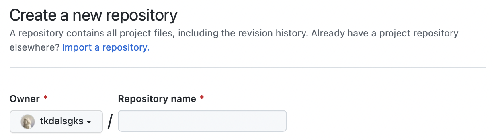
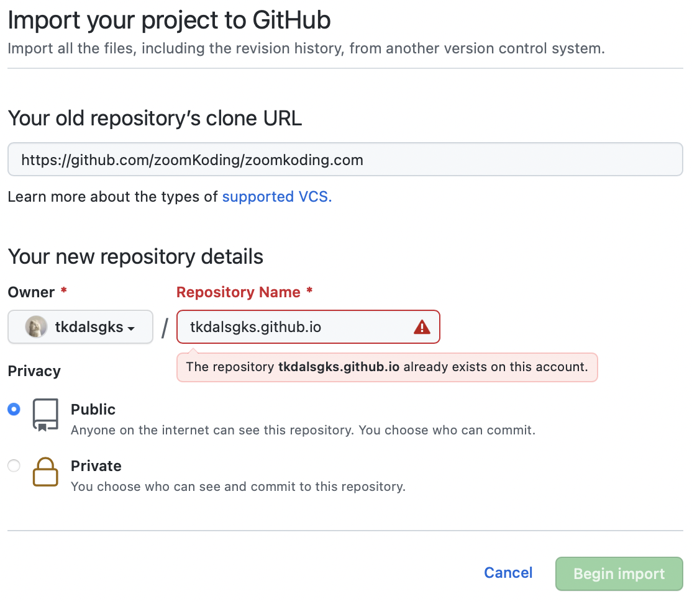
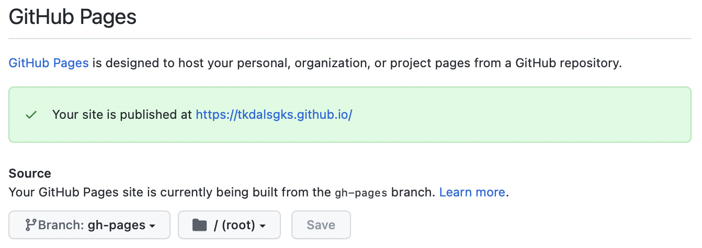

### 💅 깔끔하고 예쁜게 최고

깔끔하고 예쁘고, 한눈에 잘 들어올 테마가 어떤것이 있을까 찾아보았다.
그렇게 github 파도타기를 하며 테마를 찾던 중, **zoomkoding-gatsby-blog** 테마가 눈에 들어왔다.
줌코딩님의 테마는 카테고리 별로 보기 쉽게 정리할 수도 있었다.


### 🚀 이제 만들어보자

GitHub Page나 Netlify 중 배포 환경을 고를 수 있는데, GitHub Page가 더 편해서 나는 이걸로 만들었다.
Netlify로 만들고 싶다면 [Netlify로 만들기](https://github.com/leedawnn/leedawnn.github.io/tree/master#-netlify로-만들기) 를 참고하시면 됩니다.

1. Repository 생성하기
   

   일반적으로 repo를 생성하는 것과는 다르게 __Import a repository__를 클릭하여, 줌코딩님의 테마를 import 해온다.

   

   들어가면 위와 같은 페이지가 나오게 되는데, URL에는 [https://github.com/zoomKoding/zoomkoding.com](https://github.com/zoomKoding/zoomkoding.com)을 넣어주면 된다.

   ⚠️ 다른 테마를 원한다면 [Gatsby Starters](https://www.gatsbyjs.com/starters/)를 참고하세요.

   ⚠️ **Repository명은 꼭 [GitHubID].github.io로 설정 할 것 !**

   Begin Import 버튼을 누르면 어느 정도의 시간이 흐르고, 줌코딩님의 테마를 import한 Repository가 생성된다.

2. Repository 가져오기

   이제 레퍼지토리로 가서 내 컴퓨터에 git clone을 하여 블로그를 다운로드한다.

   ```bash
   cd [Repository를 저장할 폴더]
   git clone [복사한 주소]
   ```

3. Blog 설치하기

   블로그를 동작시킬 수 있도록 설치되어 있는 패키지들을 다운로드 해야하는데, 다음 명령어를 실행하시면 받을 수 있다.

   ```bash
   cd [Repository 주소]
   npm install
   ```

4. Blog 배포 준비하기

   이제 줌코딩 테마를 GitHub 페이지에 올리기 위해 **gh-pages**라는 패키지를 설치해야 한다.

   ```bash
   npm install gh-pages --save-dev
   ```

   그러고 나서, **package.json**에 다음을 추가합니다.

   ```bash
   {
     "scripts": {
       "deploy": "gatsby build && gh-pages -d public" // 추가
     }
   }
   ```

5. Blog 배포하기

   배포 준비가 완료되었다. 이제 다음 명령어을 실행하면 **GitHub Page** 에 배포할 수 있다.

   ```bash
   npm run deploy
   ```

   조금 기다리면  `Published`라는 메시지가 뜨는데, 해당 문구를 발견하셨다면 배포는 정상적으로 완료 !

   줌코딩님의 테마를 사용하시려면 node 14버전 이상이어야 합니다 !

   > ⚠️ node 버전이 14 이상이어야 합니다. node -v를 통해 node 버전을 확인하신 후 낮은 버전이라면 업그레이드를 진행해주세요 !

6. Repository Source Branch 변경하기
   
   마지막으로, GitHub 페이지가 작동하려면 GitHub의 Repository 설정에서 배포 할 Branch를 선택해야한다.
   이를 위해서 Repository에 있는 Settings를 클릭하고 죄측 메뉴에서 Pages를 클릭하여 Github Pages 설정 페이지로 이동한다.

   

   여기에서 Source에 있는 Branch를 master(main)에서 gh-pages로 변경한 후에 저장한다.
   
7. 배포된 페이지 확인하기

   이제 실제로 블로그가 잘 배포되었는지 확인하려면, **[GitHubID].github.io** 에 접근하면 된다.

8. 수정하고 배포하기

   블로그 수정 할 때는 변동사항을 commit 후 아래 명령어를 실행하면 빠르게 배포된다.

   ```bash
   npm run deploy
   ```


### ✍️ 블로그 정보 입력하기

줌코딩 테마를 통해 기본적인 블로그를 완성시켰다. 이제 블로그 정보를 입력하여 나만의 블로그를 커스텀하면 된다.

1. 블로그 기본 정보

   ```json
   title: '' // tkdalsgks.github.io
   description: '' // tkdalsgks blog
   language: 'ko', // 'ko', 'en' (영어 버전도 지원하고 있습니다.)
   siteUrl: '' // https://tkdalsgks.github.io
   ogImage: '/og-image.png', // 공유할 때 보이는 미리보기 이미지로 '/static' 하위에 넣고 싶은 이미지를 추가하시면 됩니다.
   ```

2. 댓글 설정

   블로그 글들에 댓글을 달 수 있길 원하신다면 utterances를 통해서 이를 설정할 수 있다.

   > utterances 사용방법은 [링크](https://utteranc.es/)를 참고해주세요!

   ```json
   comments: {
    utterances: {
        repo: '' // tkdalsgks/tkdalsgks.github.io
      },
   }
   ```

3. 글쓴이 정보

   author에 입력한 정보는 홈페이지와 about 페이지 상단에 있는 나를 소개하는 섹션인 bio에서 사용된다.
   description에 자신을 설명하는 문구들을 넣으면 애니메이션으로 보여지게 되고, bio에 들어가는 이미지를 바꾸려면 assets에 원하시는 파일을 추가하고 파일의 이름을 thumbnail에 넣어주면 된다.
   
   ```json
   author: {
      name: `한상민`,
      bio: {
         role: `개발자`,
         description: ['소통의 가치를 아는', '끝까지 해내려 노력하는', '이로운 것을 나누고픈'],
         thumbnail: 'memoji.png', // Path to the image in the 'asset' folder
      },
      social: {
         github: `https://github.com/tkdalsgks`,
         linkedIn: ``,
         email: `alstkdgks@gmail.com`,
      },
   },
   ```


### 🗣 about page 만들기

about 페이지 또한 gatsby-meta-config.js를 통해 생성된다. about 하위에 있는 timestamps와 projects에 각각 정보를 입력하면 about 페이지가 자동 생성된다.

1. timestamps

   아래와 같이 각 timestamp 정보를 배열로 제공해주면 입력한 순서에 맞춰서 timestamps section에 보여지게 된다.

   ```json
   {
   date: '2021.01 ~',
   activity: '개인 블로그 개발 및 운영',
   links: {
      post: '/make-gatsby-starter-zoomkoding',
      github: 'https://github.com/zoomkoding/zoomkoding-gatsby-blog',
      demo: 'https://www.zoomkoding.com',
      },
   },
   ```

2. projects

   마찬가지로 각 project 정보를 배열로 입력하면 순서대로 projects section에 보여지게 된다.

   ```json
   {
   title: '개발 블로그 테마 개발',
   description:
      '개발 블로그를 운영하는 기간이 조금씩 늘어나고 점점 많은 생각과 경험이 블로그에 쌓아가면서 제 이야기를 담고 있는 블로그를 직접 만들어보고 싶게 되었습니다. 그동안 여러 개발 블로그를 보면서 좋았던 부분과 불편했던 부분들을 바탕으로 레퍼런스를 참고하여 직접 블로그 테마를 만들게 되었습니다.',
   techStack: ['gatsby', 'react'],
   thumbnailUrl: 'blog.png',
   links: {
      post: '/gatsby-starter-zoomkoding-introduction',
      github: 'https://github.com/zoomkoding/zoomkoding-gatsby-blog',
      demo: 'https://www.zoomkoding.com',
      }
   },
   ```

이렇게 내용을 문제 없이 입력하셨다면 나만의 블로그가 탄생한 것을 확인하실 수 있습니다.


> 이 게시글은 [zoomkoding-gatsby-blog](https://github.com/zoomkoding/zoomkoding-gatsby-blog)을 보고 작성하였습니다.

```toc

```

